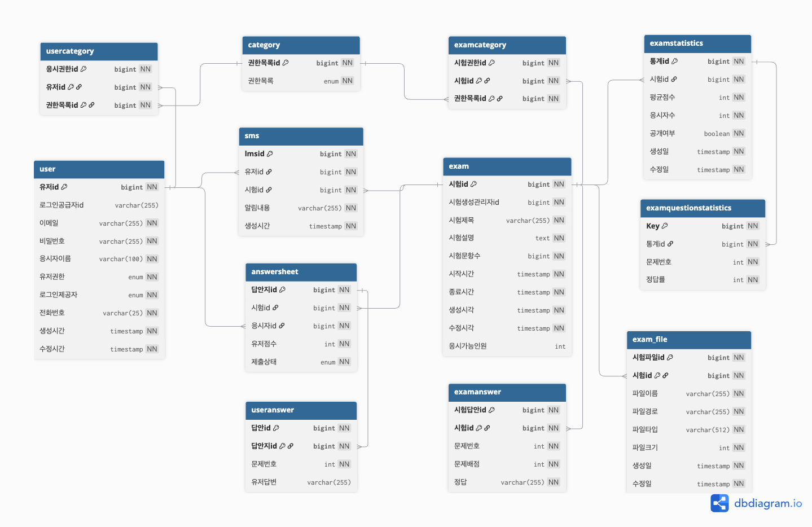

# 🍋‍🟩 프로젝트 "모히또" (MOHITTO)


- 진행 기간 : 2025.05.27 - 2025.07.02
- 개발 인원 : 6인

<i>"시험 본 지 얼마 안 된 것 같은데… 뭐, 이걸 또 하라고?"</i>

반복되는 온라인 시험과 설문에 지친 사용자들의 목소리에서 출발한,
**모히또**는 질문·응답 기반의 온라인 시험 플랫폼입니다.

사용자는 시험에 응시하고, 답안을 제출하며, 결과를 실시간으로 확인할 수 있습니다.
본 프로젝트는 이러한 온라인 시험 흐름 전반을 지원하는 백엔드 시스템을 구현합니다.

<br>

## 🎯 프로젝트 목표

- 시험 생성, 응시, 채점, 통계 분석까지 가능한 온라인 시험 플랫폼 개발
- 시험 응시 권한을 확인하는 인증 체계 구축
- 시험 응시시 발생하는 동시성 문제 해결
- 자동 채점 및 통계 기능 제공
- CI/CD 환경 구축

<br>

## 💻 기술 스택

<div style="display: flex; justify-content: center;">
  
  
  
  
  
</div>

<div style="display: flex; justify-content: center;">
  
  
  
  
  
  
  
</div>

<div style="display: flex; justify-content: center;">
  
  
</div>

<div style="display: flex; justify-content: center;">
  
  
  
  
  
</div>

<div style="display: flex; justify-content: center;">
  
  
  
  
  
  
</div>

<br>

## 🗞 ERD



<br>

## 📄 API 명세서

## 주요 기능

<details>
<summary>인증/인가</summary>

<br>

**세션 기반 인증 및 역할 기반 인가**

- Redis + 세션 기반 인증 구조
    - 로그인 시 사용자 정보를 객체에 담아 Redis에 저장
    - 세션 ID 는 UUID를 사용하여 생성 후 쿠키에 담아 클라이언트로 전달

- Filter, Interceptor를 활용한 커스텀 어노테이션 기반 인가 처리
    - 모든 요청 전 쿠키에서 추출한 세션ID 바탕으로 Redis 조회, request에 저장
    - 메서드에 선언된 커스텀 어노테이션 @CheckAuth(Role) 기반 접근 권한 제어

- 소셜 로그인
    - OAuth2.0
    - 카카오 로그인 REST AP
    - 시험 생성 시 관련 문제 및 권한 정보(카테고리)를 함께 등록 가능

</details>

<details>
<summary>시험 생성</summary>

<br>

**시험 생성 기능 제공 , 시험 정보 및 관련 리소스를 포함하여 플랫폼 등록**

- 시험 + 문제 + 카테고리의 구조적 저장
    - 시험 생성 시 관련 문제 및 권한 정보(카테고리)를 함께 등록 가능

- S3를 활용한 시험 파일 관리
    - 사용자가 업로드한 시험 문제 파일을 AWS S3에 저장
    - 업로드된 파일의 URL을 시험과 연동하여 DB에 저장
    - S3 Pre-Signed URL을 통해 보안성 있게 접근 가능

</details>

<details>
<summary>시험 응시/채점</summary>

<br>

**빈 답안지 제공, 해당 답안지에 답안 저장 및 최종 제출 이후 채점과 결과 조회**

- 상태 기반의 설계
    - STARTED → IN_PROGRESS → SUBMITTED → GRADED

- 카테고리 기반 권한 검사
    - 시험 카테고리와 사용자 카테고리의 일치 여부로 응시 가능 여부 판단

- 자동 채점 로직 내장
    - 시험 종료 시 정답 기반 비교와 점수 계산을 서버에서 수행

- 채점 결과 SMS 전송
    - 채점 완료 시 사용자에게 점수를 문자로 안내 (Solapi 연동)
    - 사용자는 수신한 메시지 내역조회 가능

</details>

<details>
<summary>통계</summary>

<br>

**채점 결과를 기반으로 평균 점수, 응시자 수, 정답률 등 시험 통계 자동 생성 및 조회 제공**

- 자동 통계 생성
    - 채점 완료된 시험의 평균 점수, 응시자 수, 문제별 정답률 계산 및 저장

- 공개 여부 관리
    - 관리자가 통계의 공개/비공개 상태를 전환하고 사용자 접근 제어

- 정규화/비정규화 조회 분리
    - 단건 조회는 JPA, 조건 조회는 QueryDSL로 구현

- 미존재 통계 예외 처리 없음
    - 통계가 없을 경우 빈 결과 반환 (정상 응답 처리)

</details>

## 👥 팀 구성 및 기능 담당

### 김정연 [팀장]

[](https://github.com/JyeonV)

- 시험 & 유저 답안 작성
- 시험 응시 권한 CRUD
- 개발환경 통일(Docker-compose)
- AWS 인프라 구축
- 시험 응시 인원 동시성 제어(redis ttl 활용)

### 김민준 [부팀장]

[](https://github.com/minsa05)

- 유저 CRUD
- 인증/인가
- 채점 결과 SMS 발송

### 김관형 [팀원]

[](https://github.com/kwanhyoungkim)

- 비밀번호 암호화(BCrypt)

### 장희수 [팀원]

[](https://github.com/SaltBr)

- 유저 답안지 CRUD
- 시험 응시자 조회
- 답안지 채점 & 최종 제출(Scheduler)
- CI/CD(Github Actions)

### 김태형 [팀원]

[](https://github.com/kimth-dev)

- 유저 응시 권한 CRUD
- 과목 목록 DB에 자동삽입 기능 구현
- 시험 결과 통계 기능(Scheduler)
- Query DSL 통계 조회

### 정한길 [팀원]

[](https://github.com/HanGil-Jeong)

- 시험 CRUD
- AWS S3 파일 업로드
- S3 Pre-Signed URL
- S3 파일 고아객체 관리(Scheduler)
- 소셜 로그인 구현

## ✅ 트러블슈팅

<details>
<summary>트랙잭션 커밋 지연, 범위에 따른 동시성 제어 실패</summary>

### 1️⃣ 문제 개요

- remainUsers = 50인 시험에 대해 60개의 스레드가 동시에 응시 요청을 보내는 테스트를 실행함
  ⇒ remainUsers 가 0이 아닌 값으로 남거나, AnswerSheet의 개수가 50보다 많아짐.

### 2️⃣ 문제 해결 과정

- **원인 찾기 (추론)**
    1. Lock 이 본인의 기능을 제대로 못함(범위, Redis 키 설정 등)
    2. Lock 범위 이외의 AnswerSheet 생성 과정에서 생긴 예외
    3. createAnswerSheet 메서드의 Transactional 때문
- **소거법 적용**
    1. 기존 코드에서 Transactional, AnswerSheet 생성 관련 비지니스 로직 제외 테스트 진행

    - 테스트 통과 ⇒ 1번은 원인 아님

    2. 기존 코드에서 Transactional 만 제거

    - 테스트 통과 ⇒ 2번도 원인 아님 , 3번이 원인인걸 찾아냄

    3. Transactional 의 어떤점 때문인지 원인 분석하기 위해 로그 생성해서 분석

    - **트랜잭션의 범위와 커밋 지연의 문제**로 확인

      처음 들어간 3번 스레드가 락을 획득, 조회, 감소 후 해제 한 모습을 확인했습니다.

      근데 분명 3번 스레드가 remainUsers를 감소 시켰는데도 적용(커밋)이 안된 상태로 8번 스레드가 조회한 걸 확인했습니다.
      이를 통해 **트랜잭션의 범위와 커밋 지연의 문제**로 확인 할 수 있었습니다.

  **⇒ 원인** : **락 점유 해제 시간이 트랜잭션 커밋 시점보다 빠르기 때문**에 업데이트 값이 DB에 반영 X

  락의 해제 시점이 트랜잭션 커밋 시점보다 빠른 경우 (현재)

- **해결 방법**
    - **트랜잭션 커밋 후 락을 해제**
    - 트랜잭션 커밋 이후 락을 해제하는 경우

### 3️⃣ 최종 해결책

- 락을 먼저 획득 한 후 내부 임계 영역에 트랜잭션을 넣어주는 방식으로 수정
- 같은 클래스 내의 트랜잭션을 적용한 메서드를 호출하면 프록시 적용 방식에 의해 트랜잭션이
  제대로 동작하지 않으므로 클래스 분리를 적용
- AnswerSheetLockService : Redisson 락 획득/해제를 담당하는 클래스
- AnswerSheetService : 순수하게 비지니스 로직 + 트랜잭션 책임만 가지는 클래스

### 4️⃣ 회고

- Redisson 등 분산 락을 사용할 경우, **락 해제 시점과 트랜잭션 커밋 타이밍이 어긋날 수 있음**에
  유의해야 함.

</details>

<details>
<summary>통계 미저장 문제 트러블 슈팅</summary>

### 1️⃣ 문제 개요

- `exam_statistics` 테이블에는 통계 데이터가 정상적으로 저장되었지만,`exam_question_statistics` 테이블에는 문제별 정답률 데이터가 저장되지 않는 현상이 발생.
- 이로 인해 통계 조회 시 문제별 정답률이 표시되지 않아 통계가 불안정함.

### 2️⃣ 문제 해결 과정

- 실제 DB를 확인해보니 `exam_statistics` 테이블은 채워져 있는 반면 `exam_question_statistics` 테이블은 비어있었음
- 서비스 로직에 로그를 삽입하여 흐름을 추적한 결과, `saveStatistics()` 메서드 내의
  메서드 내 아래 조건문에 의해 조기 종료되는 것을 확인

```jsx
if (examStatisticsJpaRepository.findByExamId(examId).isPresent()) {
    return;
}
```

- `exam_statistics`에 데이터가 존재하는 경우 전체 로직을 조기 종료하도록 조건이 걸려 있었음
  이로 인해 `exam_question_statistics` 테이블에 대한 저장 로직도 실행되지 않았고,
  통계 테이블 간 데이터 불일치가 발생함.
- `exam_statistics` 테이블 데이터를 수동 삭제 후 `saveStatistics()` 메서드를 다시 실행하자, `exam_question_statistics`에도 정상적으로 데이터가 저장됨.
- 이는 곧 정답률 저장 로직이 실행 자체가 안 되고 있었다는 것을 의미함.

- 현재 구조에서는 스케줄러가 주기적으로 통계를 계산하고 저장하게 되어 있으나, 기존 통계가 존재하면 모든 저장 로직이 종료되기 때문에 데이터 누락 또는 이전 오류로 인한 미반영 상태가 계속 유지될 수 있음.
  이 구조는 스케줄러 기반 자동화에 있어 중대한 결함이며, 통계 정확성과 시스템 신뢰성에 영향을 줄 수 있음.

### 3️⃣ 최종 해결책

주요 변경점

- 매 실행마다 기존 데이터를 삭제하고 저장하는식으로 구현하면 코드는 간단해지지만 불필요한 write query를 방지하고 DB부하를 최소하기 하기 위해 변경 감지 기반 저장방식으로 변경
- 기존 통계와 평균 점수, 응시자 수, 정답률을 비교후, 변경사항이 없으면 저장하지 않고 변경사항이 감지될 시 기존 통계 삭제 후 저장

### 4️⃣ 회고

### **깨달은점**

- 테이블에 데이터가 존재할 경우 저장을 생략하는 방식은 단일 테이블 구조에서는 문제 없이 작동할 수 있다.

  그러나 이번처럼 데이터가 두 개 이상의 테이블(`exam_statistics`, `exam_question_statistics`)에 분산되어 저장되는 구조에서는

  일부 테이블의 데이터가 누락되어도 이를 감지하지 못한 채 로직이 조기 종료되는 문제가 발생할 수 있다는 점을 체감했다.

- 이로 인해 조회 시 예상치 못한 데이터 누락 현상이 발생할 수 있으며,  
  특히 이러한 로직이 스케줄러 같은 자동화 기술에 적용되는 경우
  문제가 발생했을 때 실시간으로 인지하기 어려워지므로 조기 종료 조건을 더욱 신중하게 설계해야 한다는 교훈을 얻었다.

### 고려했으나 미구현 / 추후 구현 예정

- 수동 API를 통해 통계 데이터를 직접 삭제 및 재생성하는 방식도 고려했지만,

  스케줄러와 수동 API 간의 충돌을 방지하려면 **분산 락(Redis Lock 등)**을 도입해야 하고, 이는 복잡도를 증가시키게 된다.

- 하지만 현재 통계 데이터는 일반 사용자에게 실시간으로 제공될 필요는 없으며,

  관리자가 내부적으로 검토하는 용도이기 때문에, 우선순위는 낮다고 판단하여 도입을 보류하였다.

- 대신, 스케줄러의 자동화 로직을 개선하여 통계 데이터가 항상 최신 상태로 유지되도록 하는 방향으로 집중하였다.
- 현재 자동화 로직은 변경이 감지되면 기존 통계를 삭제 후 새로 저장하는 구조이기 때문에,

  기존 통계와 새로운 통계를 비교하거나, 변경 이력을 추적하는 것이 불가능하다는 단점이 있다.

- 따라서 추후 통계 변경 이력 또는 비교 기능이 필요할 경우를 대비해 다음과 같은 방안을 고려했다.
    - `version` 컬럼을 통해 통계 버전을 관리
    - `statistics_history` 테이블을 별도로 구성하여 과거 통계 이력을 저장

</details>

<details>
<summary>세션 기반 인증/인가 트러블 슈팅</summary>

### 1️⃣ 문제 개요

- @UserSession SessionUser sessionUser를 주입받은 API 에서 아래의 에러 발생

```java
java.lang.NullPointerException:
Cannot invoke "SessionUser.getUserId()"because "sessionUser"is null
```

- 원인 → 로그인된 상태에서 호출한 API임에도 sessionUser가 null로 들어옴

### 2️⃣ 문제 해결 과정

✔ 1.로그인 된 상태가 아닌 사용자가 호출한 것일것이다

✔2. Filter에서 세션을 request.setAttribute하지 못하고 있는 상태이다

✔3.ArgumentResolver에서 세션 주입이 실패했을것이다

✔4.Filter 등록 순서 문제

### 3️⃣ 최종 해결책

- 세션 주입이 안되던 문제는 Fliter 등록 순서 문제였음
- DispatcherServlet보다 먼저 실행되지 않으면 UserSession은 null이 들어오게 된다

### 4️⃣ 회고

- 세션주입이 되지않았던 문제를 처음인 인증실패로 생각했지만
  사실은 Filter와 ArgumentResolvert 실행 순서의 시작된 문제였다
- Spring에서 Filter를 직접 등록할경우 DispatcherServlet보다 먼저 실행 되도록 순서를 지정하지 않으면 Filter가 의도한 대로 작동하지 않을수가 있다
- Filter → DispatcherServlet → ArgumentResolver → Controller 이 순서가 반드시 보장되어야한다
  이
- 이번 프로젝트를 통해 Spring의 내부 실행 순서를 경험했고 Filter를 직접 등록할때 순서 조정이 필수적임을 기억해야겠다

</details>

<details>
<summary>암호화 트러블슈팅</summary>

### 1️⃣문제 개요

회원가입을 진행후 Hash 암호화를 통해 Password가 암호화되어 저장되었지만 로그인할때 다시 입력한 평문Password의 암호화된 것과 다르게 암호화되어 정보가 일치하지않아 로그인이 안됨.

### 2️⃣ 문제 해결 과정

`PasswordUtil`클래스에서 입력된 평문 password와 저장되어있던 암호화된 password를 비교하여 `boolean`을 통해 일치 불일치 하는지 확인.
하지만 회원가입때 입력한 password의 hash암호화된 정보와 로그인에 입력하는 평문과 비교시 일치하지않아 로그인이 안되고있었다.

기존에는 userservice 클래스에 이렇게 입력하여 hash화된 password를 저장했다면, 이제는 user 클래스에서 먼저 passwordutil 클래스의this.password =
PasswordUtil.hash(password); 을 통해 암호화된 password를 user 객체에 저장하게 해주고 userservice 에서는 바로 request.getPassword() 으로 사용하게 바꿔줌.

또한 로그인을 할때 비밀번호 인증을 passwordutil 클래스를 통해 진행하던걸 user 클래스를 통해 진행하도록 바꿔줌.

### 3️⃣ 최종 해결책

`passwordutil` 클래스를 통해서 진행하느냐 `user` 클래스를 통해 진행하느냐로 결과가 달라졌다.

### 4️⃣ 회고

현재 작성된 코드의 가독성과 재사용성을 높이고, 유지보수가 용이하도록 하기 위해서는 전체적인 구조를 점검하고, 중복되는 로직은 별도의 유틸리티나 공통 컴포넌트로 분리하며, 불필요하게 복잡한 부분은 단순화하는 방향으로
개선하는 개발능력의 향상이 필요할거같다.
</details>

<details>
<summary>CI/CD test 이후 deploy 실패</summary>

### 1️⃣ 문제 개요

- `build-and-test` 가 성공적으로 끝난 이후에도 `deploy` 가 실행되지 않음
- 배포 쪽의 `on: workflow_run` 이벤트가 실제로 트리거되지 않음

### 2️⃣ 문제 해결 과정

- `echo`를 써서 `github.event.workflow_run.conclusion` 값이 뭔지 출력해보려 했지만, 값 자체가 null로 나오는 것을 확인함
- `workflow_run` 이벤트에서만 해당 값들이 유효하다는 걸 알게 됨
- `github.event_name`과 `github.ref`로 대체할 수 있다는 걸 찾아내고, 현재 워크플로우 트리거에 맞게 수정

### 3️⃣ 최종 해결책

- 해결 전 사용하던 조건:

    ```yaml
    github.event.workflow_run.conclusion == 'success'
    github.event.workflow_run.head_branch == 'feat/SaltBr'
    ```

    - `on: workflow_run:`으로 정의된 워크플로우에서만 유효한 조건
- 현재 워크플로우는 `on: push`로 동작하고 있었기 때문에

  `github.event.workflow_run.*` 값은 항상 null로 들어가고, 조건문이 무조건 false가 되어버림

- 조건을 아래와 같이 현재 워크플로우 트리거에 맞도록 수정

    ```yaml
    if: github.event_name == 'push' && github.ref == 'refs/heads/feat/SaltBr'
    ```

### 4️⃣ 회고

- GitHub Actions에서 `workflow_run` 관련 정보(`conclusion`, `head_branch`)는 반드시 `on: workflow_run` 이벤트를 사용하는 워크플로우 안에서만 유효함

- `on: push`에서 `github.event.workflow_run.*`을 참조하면 항상 null이 들어가게 되므로 주의 필요

</details>

<details>
<summary>application-name 인식 실패</summary>

### 1️⃣ 문제 개요

- `aws deploy create-deployment` 명령어가 실행되었지만
    - `-application-name`이나 `-s3-location` 등의 값이 정상적으로 인식되지 않음
- 에러 메시지는 값이 없거나 잘못됐다는 식으로 나옴

### 2️⃣ 문제 해결 과정

- 원래 명령어를 여러 줄에 걸쳐 `\`로 줄바꿈 처리해 사용
- GitHub Actions의 셸 환경에서 이 줄바꿈 처리(`\`)가 의도와 다르게 작동하는 것을 의심

### 3️⃣ 최종 해결책

- **원인**

    ```yaml
    - name: EC2 Deploy
          run: aws deploy create-deployment \
            --application-name ${{ secrets.AWS_CODE_DEPLOY_APPLICATION }} \
            --deployment-config-name CodeDeployDefault.AllAtOnce \
            --deployment-group-name ${{ secrets.AWS_CODE_DEPLOY_GROUP }} \
            --s3-location bucket=${{ secrets.AWS_S3_BUCKET }},key=$GITHUB_SHA.zip,bundleType=zip
    ```

- 명령어를 여러 줄로 작성하면서 줄 끝에 `\` 를 사용
- GitHub Actions의 셸에서는 이 줄바꿈이 깨지거나 붙어버려서 인식 실패
- 명령어를 한 줄로 작성하여 실행되도록 변경

    ```yaml
    aws deploy create-deployment --application-name $APP_NAME --deployment-group-name $GROUP --deployment-config-name CodeDeployDefault.AllAtOnce --s3-location bucket=$BUCKET,key=$ZIP_NAME,bundleType=zip
    ```

### 4️⃣ 회고

- GitHub Actions에서는 bash 환경이 제한되어 있어 `\` 줄바꿈이 종종 오작동함
- 긴 명령어라도 되도록 한 줄로 처리하거나 `run: |` 블록 안에 명령어를 분리해서 실행하는 것이 안전

</details>

<details>
<summary>배포 후 애플리케이션 실행 실패</summary>

### 1️⃣ 문제 개요

- 배포는 정상적으로 진행되는 것 같았지만, 서버에서 애플리케이션이 실행되지 않음
- `build/libs` 디렉토리에 `.jar` 파일이 여러 개 생성됨

### 2️⃣ 문제 해결 과정

- 처음엔 `deploy.sh` 와 `exam-build-and-deploy-combined.yml`의 실행 경로가 모든 jar를 포함했기 때문에, 어떤 jar가 실제로 사용되고 있는지 불명확했음
- 다른 부분을 수정해도 아예 결과가 나타나지 않아서 실행된 파일이 잘못된 jar일 가능성이 있다는 것을 의심하게 됨
- `zip` 대상과 배포 스크립트에서 `plain.jar`를 제외하도록 조건을 명시함

### 3️⃣ 최종 해결책

- `Make Zip file` 단계에서 아래처럼 `plain.jar` 제외 및 `SNAPSHOT` jar만 포함하도록 수정:

    ```yaml
    - name: Make Zip file (exclude plain.jar)
      run: |
        JAR_FILE=$(ls build/libs/*SNAPSHOT.jar | grep -v plain)
        zip -r $GITHUB_SHA.zip $JAR_FILE appspec.yml scripts/deploy.sh
    ```

- EC2 서버에서 실행 대상도 `plain.jar`을 제외하고 지정:

    ```yaml
    BUILD_JAR=$(ls /home/ubuntu/build/libs/*SNAPSHOT.jar | grep -v 'plain')
    JAR_NAME=$(basename $BUILD_JAR)
    echo ">>> build 파일명: $JAR_NAME" >> /home/ubuntu/deploy.log
    ```

### 4️⃣ 회고

- `-plain.jar`는 Gradle에서 생성하는 단순 라이브러리용 jar로, 실행 진입점(main)이 없음
- 처음에는 어떤 jar가 실제 배포 대상인지 명확히 구분하지 않아 생긴 문제였음
- CI/CD에서 생성된 결과물이 여러 개일 수 있다는 점을 고려해, 명확하게 어떤 파일을 대상으로 할지 지정해주는 습관이 중요하다는 걸 배움
- 이후에도 유사한 문제가 생기지 않도록, 압축 및 실행 대상 파일을 더 명확하게 필터링하는 방식을 적용함

</details>