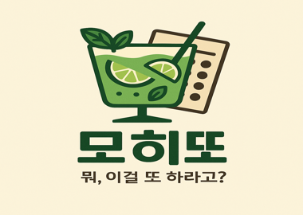

# 🍋‍🟩 프로젝트 "모히또" (MOHITTO)



- 진행 기간 : 2025.05.27 - 2025.07.02
- 개발 인원 : 6인

<i>"시험 본 지 얼마 안 된 것 같은데… 뭐, 이걸 또 하라고?"</i>

반복되는 온라인 시험과 설문에 지친 사용자들의 목소리에서 출발한,
**모히또**는 질문·응답 기반의 온라인 시험 플랫폼입니다.

사용자는 시험에 응시하고, 답안을 제출하며, 결과를 실시간으로 확인할 수 있습니다.
본 프로젝트는 이러한 온라인 시험 흐름 전반을 지원하는 백엔드 시스템을 구현합니다.

<br>

## 🎯 프로젝트 목표

- 시험 생성, 응시, 채점, 통계 분석까지 가능한 온라인 시험 플랫폼 개발
- 시험 응시 권한을 확인하는 인증 체계 구축
- 시험 응시시 발생하는 동시성 문제 해결
- 자동 채점 및 통계 기능 제공
- CI/CD 환경 구축

<br>

## 💻 기술 스택

<div style="display: flex; justify-content: center;">
  
  
  
  
  
</div>

<div style="display: flex; justify-content: center;">
  
  
  
  
  
  
  
</div>

<div style="display: flex; justify-content: center;">
  
  
</div>

<div style="display: flex; justify-content: center;">
  
  
  
  
  
</div>

<div style="display: flex; justify-content: center;">
  
  
  
  
  
  
</div>

<br>

## 🗞 ERD


<br>

## 📄 API 명세서

## 👥 팀 구성 및 담당 기능

### 김정연 [팀장]

[](https://github.com/JyeonV)

- 시험 & 유저 답안 작성
- 시험 응시 권한 CRUD
- 개발환경 통일(Docker-compose)
- AWS 인프라 구축
- 시험 응시 인원 동시성 제어(redis ttl 활용)

### 김민준 [부팀장]

[](https://github.com/minsa05)

- 유저 CRUD
- 인증/인가
- 채점 결과 SMS 발송

### 김관형 [팀원]

[](https://github.com/kwanhyoungkim)

- 비밀번호 암호화(BCrypt)

### 장희수 [팀원]

[](https://github.com/SaltBr)

- 유저 답안지 CRUD
- 시험 응시자 조회
- 답안지 채점 & 최종 제출(Scheduler)
- CI/CD(Github Actions)

### 김태형 [팀원]

[](https://github.com/kimth-dev)

- 유저 응시 권한 CRUD
- 과목 목록 DB에 자동삽입 기능 구현
- 시험 결과 통계 기능(Scheduler)
- Query DSL 통계 조회

### 정한길 [팀원]

[](https://github.com/HanGil-Jeong)

- 시험 CRUD
- AWS S3 파일 업로드
- S3 Pre-Signed URL
- S3 파일 고아객체 관리(Scheduler)
- 소셜 로그인 구현

## ✅ 트러블슈팅

<details>
<summary>트랙잭션 커밋 지연, 범위에 따른 동시성 제어 실패</summary>

### 1️⃣ 문제 개요

- remainUsers = 50인 시험에 대해 60개의 스레드가 동시에 응시 요청을 보내는 테스트를 실행함
  ⇒ remainUsers 가 0이 아닌 값으로 남거나, AnswerSheet의 개수가 50보다 많아짐.

### 2️⃣ 문제 해결 과정

- **원인 찾기 (추론)**
    1. Lock 이 본인의 기능을 제대로 못함(범위, Redis 키 설정 등)
    2. Lock 범위 이외의 AnswerSheet 생성 과정에서 생긴 예외
    3. createAnswerSheet 메서드의 Transactional 때문
- **소거법 적용**
    1. 기존 코드에서 Transactional, AnswerSheet 생성 관련 비지니스 로직 제외 테스트 진행

    - 테스트 통과 ⇒ 1번은 원인 아님

    2. 기존 코드에서 Transactional 만 제거

    - 테스트 통과 ⇒ 2번도 원인 아님 , 3번이 원인인걸 찾아냄

    3. Transactional 의 어떤점 때문인지 원인 분석하기 위해 로그 생성해서 분석

    - **트랜잭션의 범위와 커밋 지연의 문제**로 확인

      처음 들어간 3번 스레드가 락을 획득, 조회, 감소 후 해제 한 모습을 확인했습니다.

      근데 분명 3번 스레드가 remainUsers를 감소 시켰는데도 적용(커밋)이 안된 상태로 8번 스레드가 조회한 걸 확인했습니다.
      이를 통해 **트랜잭션의 범위와 커밋 지연의 문제**로 확인 할 수 있었습니다.

  **⇒ 원인** : **락 점유 해제 시간이 트랜잭션 커밋 시점보다 빠르기 때문**에 업데이트 값이 DB에 반영 X

  락의 해제 시점이 트랜잭션 커밋 시점보다 빠른 경우 (현재)

- **해결 방법**
    - **트랜잭션 커밋 후 락을 해제**
    - 트랜잭션 커밋 이후 락을 해제하는 경우

### 3️⃣ 최종 해결책

- 락을 먼저 획득 한 후 내부 임계 영역에 트랜잭션을 넣어주는 방식으로 수정
- 같은 클래스 내의 트랜잭션을 적용한 메서드를 호출하면 프록시 적용 방식에 의해 트랜잭션이
  제대로 동작하지 않으므로 클래스 분리를 적용
- AnswerSheetLockService : Redisson 락 획득/해제를 담당하는 클래스
- AnswerSheetService : 순수하게 비지니스 로직 + 트랜잭션 책임만 가지는 클래스

### 4️⃣ 회고

- Redisson 등 분산 락을 사용할 경우, **락 해제 시점과 트랜잭션 커밋 타이밍이 어긋날 수 있음**에
  유의해야 함.

</details>

<details>
<summary>통계 미저장 문제 트러블 슈팅</summary>

### 1️⃣ 문제 개요

- `exam_statistics` 테이블에는 통계 데이터가 정상적으로 저장되었지만,`exam_question_statistics` 테이블에는 문제별 정답률 데이터가 저장되지 않는 현상이 발생.
- 이로 인해 통계 조회 시 문제별 정답률이 표시되지 않아 통계가 불안정함.

### 2️⃣ 문제 해결 과정

- 실제 DB를 확인해보니 `exam_statistics` 테이블은 채워져 있는 반면 `exam_question_statistics` 테이블은 비어있었음
- 서비스 로직에 로그를 삽입하여 흐름을 추적한 결과, `saveStatistics()` 메서드 내의
  메서드 내 아래 조건문에 의해 조기 종료되는 것을 확인

```jsx
if (examStatisticsJpaRepository.findByExamId(examId).isPresent()) {
    return;
}
```

- `exam_statistics`에 데이터가 존재하는 경우 전체 로직을 조기 종료하도록 조건이 걸려 있었음
  이로 인해 `exam_question_statistics` 테이블에 대한 저장 로직도 실행되지 않았고,
  통계 테이블 간 데이터 불일치가 발생함.
- `exam_statistics` 테이블 데이터를 수동 삭제 후 `saveStatistics()` 메서드를 다시 실행하자, `exam_question_statistics`에도 정상적으로 데이터가 저장됨.
- 이는 곧 정답률 저장 로직이 실행 자체가 안 되고 있었다는 것을 의미함.

- 현재 구조에서는 스케줄러가 주기적으로 통계를 계산하고 저장하게 되어 있으나, 기존 통계가 존재하면 모든 저장 로직이 종료되기 때문에 데이터 누락 또는 이전 오류로 인한 미반영 상태가 계속 유지될 수 있음.
  이 구조는 스케줄러 기반 자동화에 있어 중대한 결함이며, 통계 정확성과 시스템 신뢰성에 영향을 줄 수 있음.

### 3️⃣ 최종 해결책

주요 변경점

- 매 실행마다 기존 데이터를 삭제하고 저장하는식으로 구현하면 코드는 간단해지지만 불필요한 write query를 방지하고 DB부하를 최소하기 하기 위해 변경 감지 기반 저장방식으로 변경
- 기존 통계와 평균 점수, 응시자 수, 정답률을 비교후, 변경사항이 없으면 저장하지 않고 변경사항이 감지될 시 기존 통계 삭제 후 저장

### 4️⃣ 회고

### **깨달은점**

- 테이블에 데이터가 존재할 경우 저장을 생략하는 방식은 단일 테이블 구조에서는 문제 없이 작동할 수 있다.

  그러나 이번처럼 데이터가 두 개 이상의 테이블(`exam_statistics`, `exam_question_statistics`)에 분산되어 저장되는 구조에서는

  일부 테이블의 데이터가 누락되어도 이를 감지하지 못한 채 로직이 조기 종료되는 문제가 발생할 수 있다는 점을 체감했다.

- 이로 인해 조회 시 예상치 못한 데이터 누락 현상이 발생할 수 있으며,  
  특히 이러한 로직이 스케줄러 같은 자동화 기술에 적용되는 경우
  문제가 발생했을 때 실시간으로 인지하기 어려워지므로 조기 종료 조건을 더욱 신중하게 설계해야 한다는 교훈을 얻었다.

### 고려했으나 미구현 / 추후 구현 예정

- 수동 API를 통해 통계 데이터를 직접 삭제 및 재생성하는 방식도 고려했지만,

  스케줄러와 수동 API 간의 충돌을 방지하려면 **분산 락(Redis Lock 등)**을 도입해야 하고, 이는 복잡도를 증가시키게 된다.

- 하지만 현재 통계 데이터는 일반 사용자에게 실시간으로 제공될 필요는 없으며,

  관리자가 내부적으로 검토하는 용도이기 때문에, 우선순위는 낮다고 판단하여 도입을 보류하였다.

- 대신, 스케줄러의 자동화 로직을 개선하여 통계 데이터가 항상 최신 상태로 유지되도록 하는 방향으로 집중하였다.
- 현재 자동화 로직은 변경이 감지되면 기존 통계를 삭제 후 새로 저장하는 구조이기 때문에,

  기존 통계와 새로운 통계를 비교하거나, 변경 이력을 추적하는 것이 불가능하다는 단점이 있다.

- 따라서 추후 통계 변경 이력 또는 비교 기능이 필요할 경우를 대비해 다음과 같은 방안을 고려했다.
    - `version` 컬럼을 통해 통계 버전을 관리
    - `statistics_history` 테이블을 별도로 구성하여 과거 통계 이력을 저장

</details>

<details>
<summary>세션 기반 인증/인가 트러블 슈팅</summary>

### 1️⃣ 문제 개요

- @UserSession SessionUser sessionUser를 주입받은 API 에서 아래의 에러 발생

```java
java.lang.NullPointerException:
Cannot invoke "SessionUser.getUserId()"because "sessionUser"is null
```

- 원인 → 로그인된 상태에서 호출한 API임에도 sessionUser가 null로 들어옴

### 2️⃣ 문제 해결 과정

✔ 1.로그인 된 상태가 아닌 사용자가 호출한 것일것이다
✔2. Filter에서 세션을 request.setAttribute하지 못하고 있는 상태이다
✔3.ArgumentResolver에서 세션 주입이 실패했을것이다
✔4.Filter 등록 순서 문제

### 3️⃣ 최종 해결책

- 세션 주입이 안되던 문제는 Fliter 등록 순서 문제였음
- DispatcherServlet보다 먼저 실행되지 않으면 UserSession은 null이 들어오게 된다

### 4️⃣ 회고

- 세션주입이 되지않았던 문제를 처음인 인증실패로 생각했지만
  사실은 Filter와 ArgumentResolvert 실행 순서의 시작된 문제였다
- Spring에서 Filter를 직접 등록할경우 DispatcherServlet보다 먼저 실행 되도록 순서를 지정하지 않으면 Filter가 의도한 대로 작동하지 않을수가 있다
- Filter → DispatcherServlet → ArgumentResolver → Controller 이 순서가 반드시 보장되어야한다
  이
- 이번 프로젝트를 통해 Spring의 내부 실행 순서를 경험했고 Filter를 직접 등록할때 순서 조정이 필수적임을 기억해야겠다

</details>